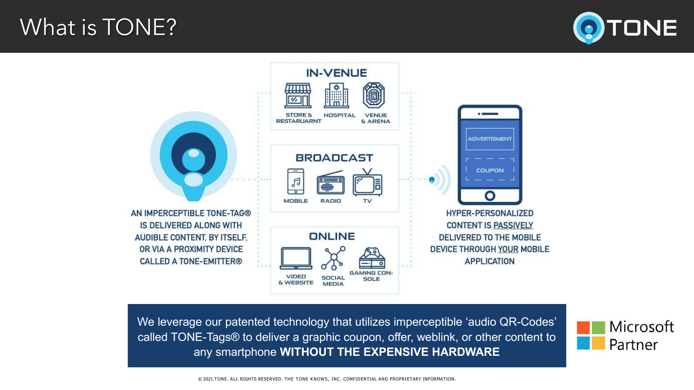
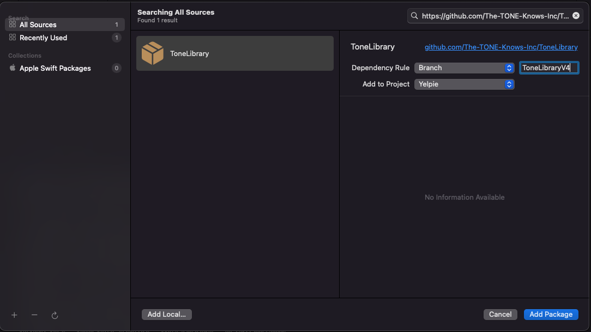
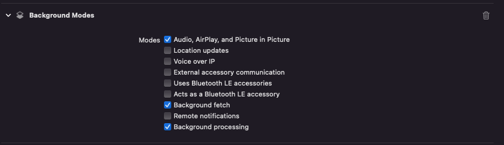

# Tone

We leverage our patented technology that utilizes imperceptible `Audio QR Codes` called `TONE-Tags` to deliver a graphic coupon, offer, weblink or other content to any smartphone **WITHOUT THE EXPENSIVE HARDWARE**.



## Requirements
- Swift 5.3+
- IOS 13+

## Installation

### Swift Package Manager

1. Select Project
2. Select Package Dependencies Tab
3. Click +
4. Enter `https://github.com/The-TONE-Knows-Inc/ToneLibrary` in the package url
5. Select Dependency Rule - Branch, enter `ToneLibraryV4` 
6. Select `Add Package`


## Usage
1. You need to add `Background modes` capabilites to your project to allow use microphone and other services in background.



2. Add `frecuencies_table.json` to your project. <a href="frequency_tables.json" download> Click to Download </a>

3. Add `NSMicrophoneUsageDescription` key in info.plist to justify why your app is using Microphone.
```swift
<key>NSMicrophoneUsageDescription</key>
<string>Need microphone to detect Tone Tags</string>
```

4. Copy code below in any ViewController.
```swift
import ToneListen

override func viewDidLoad() {]
    setupTone()
}

deinit {
    toneFramework.stop()
}

private func setupTone() {
    let clientId = "900005"
    toneFramework.setClientId(clientID: clientId)
    
    let notificationName = Notification.Name("responseObjectNotificationName")
    
    NotificationCenter.default.addObserver(
        self,
        selector: #selector(methodOfReceivedNotification(notification:)),
        name: notificationName,
        object: nil
    )
    
    toneFramework.start()
}

@objc func methodOfReceivedNotification(notification: NSNotification) {
    guard let json = notification.userInfo
    else { return }
    
    // do necessary logic based on the json response
    print(json)
}
```


